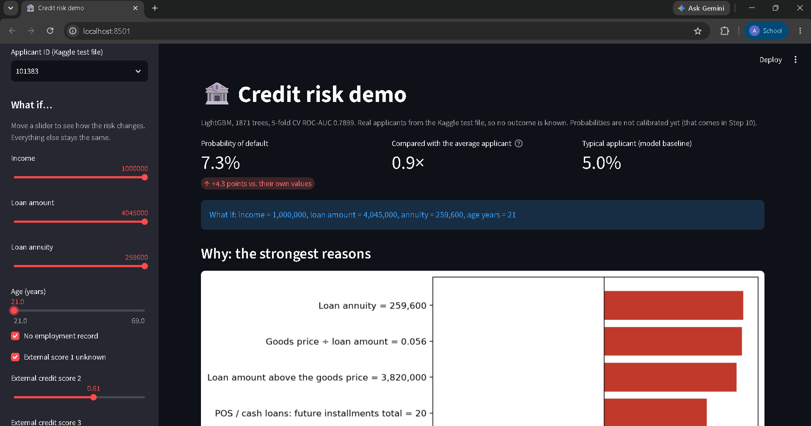

# Trustworthy Credit Risk Scoring

An end-to-end loan-default model on the **Home Credit Default Risk** data (307,511 real loan
applications, 7 linked tables), built to be accurate *and* honest: every number comes with a
confidence interval, and the system explains each score. PRML course project, IIT Dharwad (2026).

> **Status:** work in progress (Step 9 of 18). All numbers below are 5-fold cross-validation
> on the 60% training split. The 20% test split stays locked until the final evaluation.



## Results so far

| Model | 5-fold CV ROC-AUC | 95% CI |
|---|---|---|
| **Tuned LightGBM (final model)** | **0.790** | 0.787–0.793 |
| LightGBM, default settings | 0.787 | |
| XGBoost | 0.785 | |
| HistGradientBoosting | 0.783 | |
| EBM (glass-box model) | 0.776 | |
| Logistic regression | 0.776 | 0.772–0.779 |
| PyTorch MLP with category embeddings | 0.772 | 0.768–0.775 |
| WoE scorecard (30 features, points table) | 0.755 | 0.751–0.758 |
| Decision tree | 0.725 | 0.721–0.730 |
| LightGBM on the main table only | 0.761 | 0.758–0.765 |
| Always "no default" | 0.500 | |

14 models were compared on the same folds with the same leak-free rules. Rows from the model
ladder used the features from before a small fix (it moved LightGBM by +0.001).

## What I found

- **History matters:** the six loan-history tables add **+0.025 ROC-AUC** over the main
  application table (an ablation, one table at a time).
- **Boosting wins, the library doesn't matter:** LightGBM, XGBoost and HistGradientBoosting
  are within 0.003 of each other. A glass-box EBM is only 0.01 behind; a bank-style points
  scorecard costs 0.031.
- **Class imbalance "fixes" hurt:** class weights, undersampling and SMOTE all *lowered*
  ROC-AUC. Weights and undersampling pushed the average predicted probability from 8% to
  27–34%. SMOTE kept honest probabilities for a surprising reason: every synthetic row had an
  "in-between" value no real person has, and a model could spot them perfectly (ROC-AUC 1.000).
- **Tuning helped a little:** Optuna, random and grid search at the same budget ended close;
  the tuned model gained **+0.003** (significant in a paired bootstrap).
- **Neural networks lose on this table data:** the MLP is 0.018 behind LightGBM, and a blend
  of the two is *worse* than LightGBM alone (their predictions correlate at 0.89).
- **From scratch:** seven classic algorithms (logistic regression by Newton's method with a
  Laplace Bayesian version, Naive Bayes, PCA, Fisher LDA, K-means++, GMM with EM, an MLP with
  backprop) written in NumPy match scikit-learn; K-means and EM from the same start give
  identical answers, and the MLP gradient check error is 2e-7.
- **Bugs caught by checking the data:** counting split payments row by row said 67% of
  installments were underpaid (per installment it was 0%), and a "365243" date code had
  quietly emptied two features.

## The demo app

The model uses 240 features, mostly from loan history, so nobody can type them in. The app
picks **real applicants from the Kaggle test file** (no outcome is known for them), shows the
default probability and the strongest reasons, and lets you change 8 key fields (income, loan
amount, annuity, age, years employed, three external credit scores) to see what happens. The
features are rebuilt with exactly the training code; the reasons are TreeSHAP values.

```bash
make app     # Streamlit page at http://localhost:8501 (builds the demo data on first run)
make api     # FastAPI service at http://localhost:8000 (interactive docs at /docs)
```

```bash
curl "localhost:8000/applicants?limit=3"                       # some demo applicant ids
curl -X POST localhost:8000/score -H "Content-Type: application/json" \
     -d '{"applicant_id": <an id from above>, "changes": {"income": 250000}}'
```

The response has the probability, how it compares with the average applicant (8.1%), and the
top 4 reasons pushing the risk up and down. Input is validated (for example, external scores
must be between 0 and 1). Probabilities are not calibrated yet; that is the next step.

## How it is built

```
7 CSV tables -> Parquet -> 240 features (one row per applicant, leak-free aggregates)
             -> frozen splits (train 60 / valid 10 / conformal 10 / test 20, 5 CV folds)
             -> one CV runner for every model (bootstrap CIs, paired tests, MLflow)
             -> model ladder -> experiments -> tuned LightGBM -> API + app
```

**Still to come:** calibration and a money-based approval threshold, a conformal
approve / refer / decline layer, reason codes and counterfactuals, a fairness audit with
mitigation, clustering, the one-time test-set evaluation, Docker, CI and drift monitoring.

## Run it yourself

```bash
python3 -m venv .venv && source .venv/bin/activate
pip install torch --index-url https://download.pytorch.org/whl/cpu
pip install -r requirements.txt
pip install -e .
```

The data is not included (Kaggle competition rules). Accept the rules on the competition page,
then:

```bash
make data && make parquet && make splits && make features
```

The notebooks in `notebooks/` reproduce every number (`06_experiments.ipynb` trains and saves
the final model to `models/`). Then `make app`.

| Command | What it does |
|---|---|
| `make test` | Run the tests |
| `make lint` | Check the code |
| `make mlflow` | Open the experiment dashboard |
| `make demo-data` | Rebuild the app's demo applicants |

## Project layout

```
src/creditrisk/   data/  features/  models/  evaluation/  scratch/  serving/
app/              the Streamlit page
notebooks/        01-07, one per step, each ending with key facts and findings
tests/            unit tests, including every scratch algorithm vs scikit-learn
reports/          result tables and figures
```

**Tech:** Python, pandas, scikit-learn, LightGBM, XGBoost, PyTorch, Optuna, MLflow, FastAPI,
Pydantic, Streamlit.
